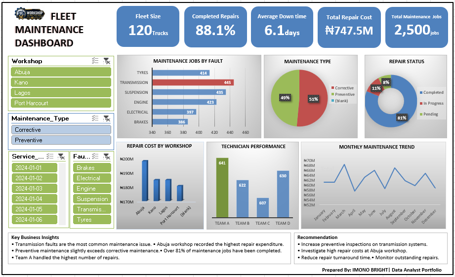

# 🚛 Fleet Maintenance Performance Dashboard

## 📂 Repository Contents

| File | Description |
|------|-------------|
| Fleet Maintenance Report.xlsb | Complete Excel workbook containing the dataset, data dictionary, calculations, pivot tables, and dashboard |
| Dashboard.png | Dashboard preview image |
| README.md | Project documentation |
## 🚀 Future Improvements

- Recreate the dashboard in Microsoft Power BI
- Build an SQL database to store maintenance records
- Develop predictive maintenance models
- Automate monthly reporting using Power Query
- ## 👤 About the Author

**Bright Imono**

Data Analyst with an interest in business intelligence, dashboard development, and data-driven decision-making.

📊 Data Analyst

🚚 Fleet Analytics

📈 Excel | Power BI | SQL | Python

📂 Featured Projects

🏆 Certifications

Feel free to connect and explore my other projects.

## 🧠 Skills Demonstrated

- Data Cleaning
- Exploratory Data Analysis (EDA)
- KPI Development
- Dashboard Design
- Data Visualization
- Business Analysis
- Microsoft Excel
- Pivot Tables
- Pivot Charts
- Data Storytelling

## 📌 Project Summary

This project demonstrates how Microsoft Excel can be used to transform raw maintenance data into actionable business insights through interactive dashboards, KPI tracking, and visual analytics.

The dashboard supports operational decision-making by enabling stakeholders to monitor maintenance performance, identify recurring issues, evaluate workshop efficiency, and optimize maintenance planning.
